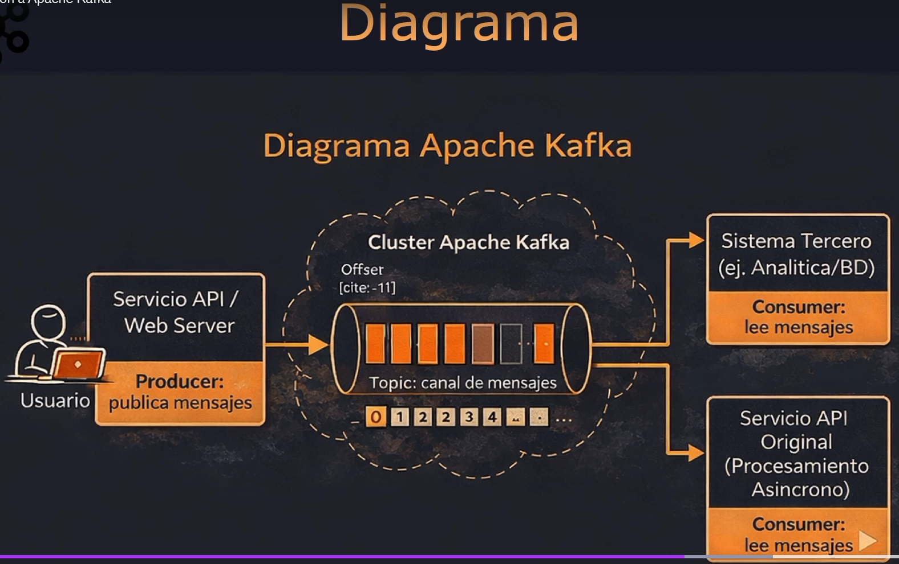

# Microservicios con Spring Boot – Spring Cloud y Apache Kafka

## Apache Kafka

Es una plataforma distribuida de mensajería y transmisión de eventos de código abierto, que se utiliza para recopilar, procesar y almacenar a gran escala los datos, es decir, está diseñada para manejar grandes volúmenes de datos en tiempo real.

Entonces, vamos a tener por un lado un microservicio que publica y se suscribe, permitiendo que las aplicaciones envíen datos, que serían los productores. Luego, tendremos un consumer o consumidor, que va a leer y recibir esa información.

### Conceptos claves

* Producer: publica mensajes
* Topic: canal de mensajes
* Consumer: lee y recibe mensajes
* Offset: posición del mensaje en el topic
* Brokers: nodos que almacenan los datos

### Arquitectura

Producer -> Kafka (Topics) -> Consumer

### ¿Por qué usar Apache Kafka?

Apache Kafka es una plataforma de mensajería y transmisión de eventos de código abierto que ofrece una serie de ventajas, como la escalabilidad, la tolerancia a fallos y la capacidad de manejar grandes volúmenes de datos en tiempo real. Además, permite la integración con otros sistemas y tecnologías, lo que facilita la construcción de soluciones complejas y robustas.

### Diagrama

